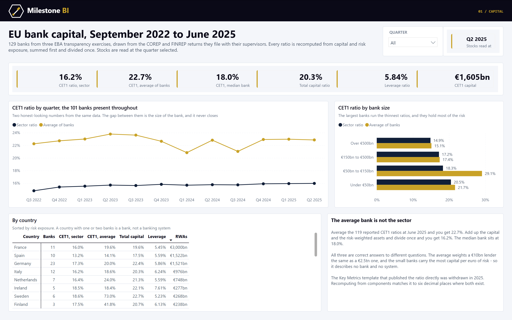

# EU bank capital - a Power BI model of supervisory returns

Three years of the EBA's EU-wide transparency exercise - bank-level data drawn from the COREP
and FINREP returns 129 EU banks file with their supervisors, September 2022 to June 2025 - rebuilt
as a Power BI star schema: capital ratios, risk-weighted assets, IFRS 9 loan quality and profit.

The whole project is text. The semantic model is TMDL, the report is PBIR, and both are generated
by the Python in `etl/`, so every measure, relationship and visual can be read and diffed in a
pull request.



## What it finds

- **The average bank is not the sector.** At June 2025 the sector's CET1 ratio - capital summed,
  risk-weighted assets summed, divided once - is **16.2%**. The median bank holds 18.0%. Average
  the 119 banks' own ratios and you get **22.7%**. Three banks with almost no risk-weighted assets
  (two municipal lenders and a custody bank, at 353%, 89% and 74%) carry much of that gap; without
  them the average is still 18.8%.
- **The gap does not close.** On a constant panel of 101 banks the sector ratio rose from 14.8% to
  16.0% over three years, and the average of banks sat about seven points above it in every
  quarter.
- **Size is risk weight.** The 16 banks with over €500bn of assets hold 60% of the risk-weighted
  assets at a density of 32% of their balance sheet, against 84% for banks under €50bn.
- **Adding up the P&L more than doubles profit.** The returns report profit year to date. Summing
  a year's four figures gives €489bn for FY2024 against €196bn actually earned.

## What the source needs before any of that is true

| Problem | Decision |
|---|---|
| Every item code is renumbered every exercise (CET1 is 2320102, 2420102, 2520102) | Earlier codes mapped forward through the 2025 data dictionary; the build fails on any unmapped row |
| The P&L is year to date, and one bank's financial year ends in June | Each bank de-cumulated against its own previous quarter within its own financial year; blank where the prior quarter is missing, never guessed. Full-year figures use each bank's four-quarter YTD |
| The Key Metrics template (headline CET1 and leverage ratios) was withdrawn in 2025 | Not used: every ratio is recomputed from components, matching the reported ratio to six decimal places wherever both exist |
| An "All other banks" aggregate sits in the file under an LEI of twenty X's | 2,432 rows dropped |
| Fair-value-level and counterparty breakdowns sit beside their totals | 42,834 breakdown rows dropped; IFRS 9 stage rows kept because they have no total row |
| Banks join and leave between exercises | A constant panel of the 101 banks reporting CET1 in all twelve quarters, used for every trend |
| Units are not stated | EUR millions, confirmed against a known balance sheet; ratios are decimals |
| Financial year-end is written three ways across the three editions | Normalised |

The ten top-level lines of the OV1 template, including the 2025 output-floor adjustment,
reconcile to each bank's reported total risk exposure in every quarter to within €0.001m.

## Model

| Table | Grain | Rows |
|---|---|---|
| `Prudential` | bank x quarter x item x IFRS 9 stage, one partition per exercise | 230,086 |
| `Bank` | LEI, with country, size band and constant-panel flag | 129 |
| `Period` | quarter-end | 12 |
| `Item` | supervisory line item, keyed on the 2025 code | 158 |
| `Stage` | IFRS 9 stage | 4 |

Balance-sheet and capital figures are stocks: every such measure reads the last quarter in view
and never sums across quarters. Ratios are always numerator over denominator, summed first.

## Build

```
python etl/build_star_schema.py --source <folder with 2023/ 2024/ 2025/ from the EBA>
python etl/build_model.py            # TMDL - partitions read data/ from this repo on GitHub
python etl/build_report.py           # PBIR
powershell -File etl/check_tmdl.ps1  # parse the TMDL with Desktop's own serializer
```

Each year folder needs `tr_oth.csv`, `TR_Metadata.xlsx` and `SDD.xlsx` from the exercise's full
database. Open `Bank Capital.pbip` in Power BI Desktop and refresh. `etl/verify_measures.py`
recomputes capital, ratios, asset quality and profit in pandas by quarter, by size band and by
year and diffs them against the live model - 166 checks, all passing.

## Source

European Banking Authority, [EU-wide transparency exercise](https://www.eba.europa.eu/risk-and-data-analysis/risk-analysis/eu-wide-transparency-exercise),
2023, 2024 and 2025 editions. Reproduction of EBA material is authorised provided the source is
acknowledged. The derived CSVs in `data/` are that material, reshaped. Code: see `LICENSE`.

Built by [Milestone BI](https://milestonebi.com/bank-capital/).
